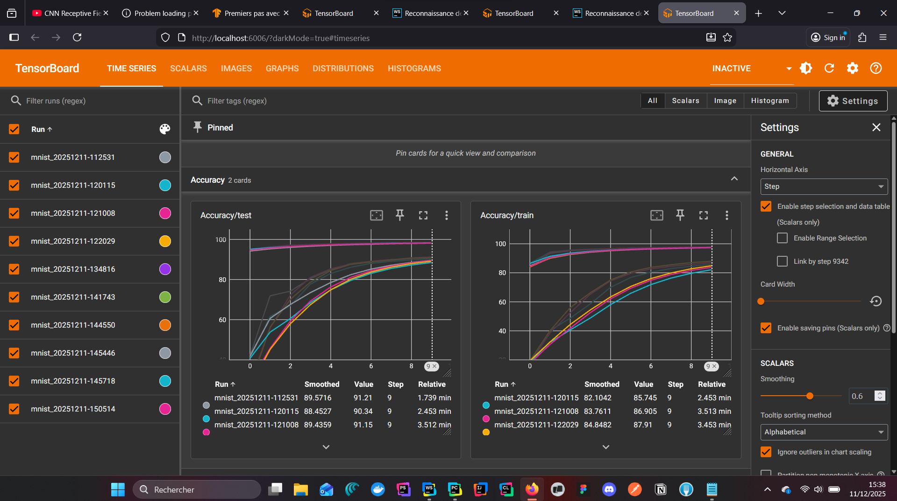

# Rendu Projet IA
Olivier Delmas\
github pages: https://sol1de.github.io/web-ia/

# Reconnaissance de Chiffres Manuscrits

Application web de reconnaissance de chiffres manuscrits (0-9) utilisant un réseau de neurones convolutif (CNN) entraîné sur le dataset MNIST provenant de Hugging Face (pas de pytorch).

## Apercu

L'utilisateur dessine un chiffre sur un canvas, et le modèle prédit en temps réel le chiffre reconnu avec un niveau de confiance et la distribution des probabilités pour chaque classe.

## Stack Technique

| Composant | Technologie |
|-----------|-------------|
| Entraînement | PyTorch |
| Dataset | MNIST (Hugging Face Datasets) |
| Monitoring | TensorBoard |
| Format modèle | ONNX |
| Inférence web | ONNX Runtime Web |
| Frontend | HTML5 / CSS / JavaScript vanilla |

## Structure du Projet

```
web-ia/
├── index.html        # Interface utilisateur
├── style.css         # Styles
├── script.js         # Logique canvas + inférence ONNX
├── model.onnx        # Modèle exporté pour le web
├── rendu.ipynb       # Notebook d'entraînement
├── runs/             # Logs TensorBoard
└── README.md
```

## Installation et Utilisation

### preview


### Lancer TensorBoard
```bash
.venv\Scripts\tensorboard --logdir=runs
```

---

## Description Technique du Modèle

### 1. Architecture CNN (Convolution + MLP)

Le modèle `NeuralNetwork` est un réseau convolutif à deux étages suivi d'un perceptron multicouche.

#### Partie Convolutive

| Couche | Opération | Entrée → Sortie | Paramètres |
|--------|-----------|-----------------|------------|
| Conv2d | Convolution 3×3 | 1×28×28 → 32×28×28 | padding=1 conserve les dimensions |
| BatchNorm2d | Normalisation | 32×28×28 | Stabilise l'apprentissage |
| ReLU | Activation | 32×28×28 | Non-linéarité |
| MaxPool2d | Sous-échantillonnage | 32×28×28 → 32×14×14 | kernel_size=2 divise par 2 |
| Conv2d | Convolution 3×3 | 32×14×14 → 64×14×14 | Extraction de features plus abstraites |
| BatchNorm2d | Normalisation | 64×14×14 | |
| ReLU | Activation | 64×14×14 | |
| MaxPool2d | Sous-échantillonnage | 64×14×14 → 64×7×7 | |

#### Partie MLP

```
Flatten: 64×7×7 = 3136 → vecteur 1D
Linear:  3136 → 128
BatchNorm1d + ReLU + Dropout(0.3)
Linear:  128 → 10 (classes)
```

Les filtres convolutifs extraient des caractéristiques spatiales (bords, formes) tandis que le MLP effectue la classification finale.

---

### 2. Dropout

- **Position** : Entre les deux couches du MLP
- **Taux** : 30% des neurones désactivés pendant l'entraînement
- **Objectif** : Prévenir le surapprentissage en forçant le réseau à ne pas dépendre de neurones spécifiques
- **Comportement** : Actif uniquement en mode `model.train()`

---

### 3. TensorBoard

#### Métriques loggées

| Métrique | Fréquence | Description |
|----------|-----------|-------------|
| Loss/train_batch | Chaque 100 batches | Loss instantanée |
| Loss/train_epoch | Chaque epoch | Loss moyenne sur l'epoch |
| Loss/test | Chaque epoch | Loss sur le jeu de test |
| Accuracy/train | Chaque epoch | Précision entraînement |
| Accuracy/test | Chaque epoch | Précision test |
| Parameters/* | Chaque epoch | Histogrammes des poids |
| Gradients/* | Chaque epoch | Histogrammes des gradients |

#### Visualisations additionnelles

- Graphe du modèle
- Échantillons d'images

---

### 4. Normalisation

#### A. Normalisation des données

- Centrage des données autour de 0
- Réduction de la variance à ~1
- Accélère la convergence et stabilise l'optimisation

#### B. Batch Normalization

| Type | Effet |
|------|----------------------------|
| BatchNorm2d | Normalise les feature maps |
| BatchNorm1d | Normalise les activations FC |

**Avantages combinés :**
- Permet des learning rates plus élevés
- Réduit la sensibilité à l'initialisation des poids

---

### 5. Pipeline complet

```
Image 28×28 (Hugging Face MNIST)
    ↓ ToTensor + Normalize
Tensor normalisé 1×28×28
    ↓ Conv2d + BatchNorm2d + ReLU + MaxPool
Features 32×14×14
    ↓ Conv2d + BatchNorm2d + ReLU + MaxPool
Features 64×7×7
    ↓ Flatten
Vecteur 3136
    ↓ Linear + BatchNorm1d + ReLU + Dropout(0.3)
Vecteur 128
    ↓ Linear
Logits 10 classes
    ↓ CrossEntropyLoss (softmax implicite)
Prédiction
```

---

## Inférence Web

L'inférence côté client utilise ONNX Runtime Web :

1. Le canvas 280×280 est redimensionné en 28×28
2. L'image est normalisée avec les mêmes statistiques que l'entraînement
3. Le tenseur est passé au modèle ONNX
4. Les logits sont convertis en probabilités via softmax
5. La classe avec la probabilité maximale est affichée